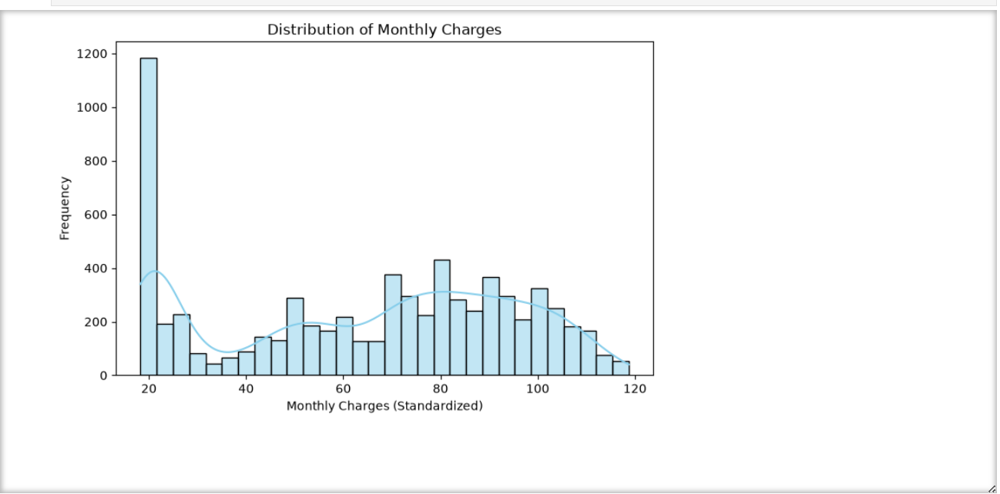
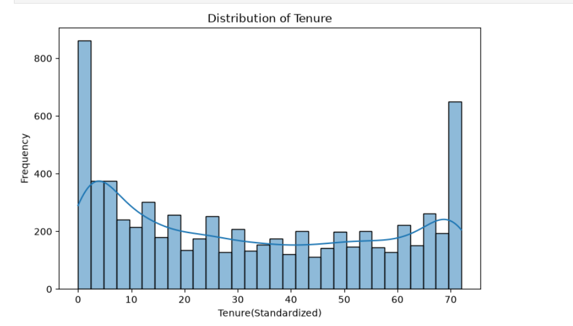
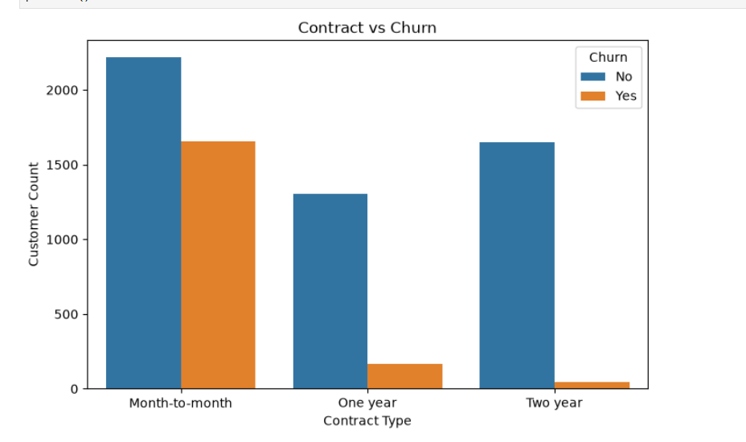
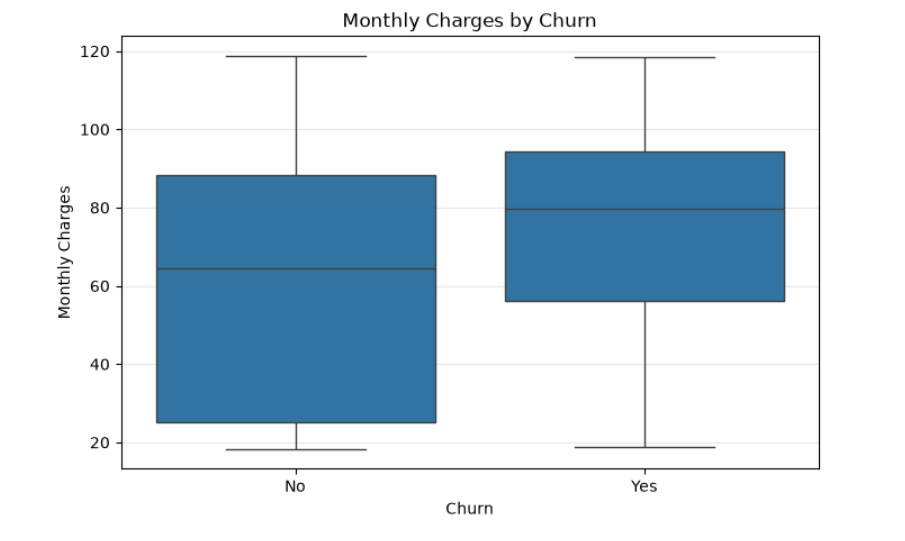
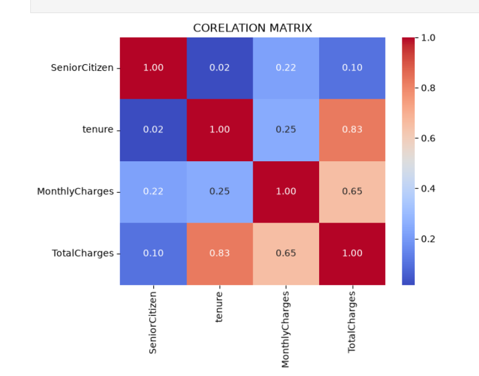

# 📊 Telco Customer Churn Analysis

An end-to-end Exploratory Data Analysis (EDA) and Data Preprocessing project performed on the IBM Telco Customer Churn dataset using Python.

This project demonstrates the complete workflow of cleaning, transforming, visualizing, and analysing customer data to uncover factors influencing customer churn.

---

## 📌 Project Objective

Customer churn is one of the biggest challenges faced by subscription-based businesses. The objective of this project is to:

- Clean and preprocess raw customer data
- Explore customer behaviour through visualizations
- Identify patterns associated with customer churn
- Prepare the dataset for future Machine Learning models

---

## 📂 Dataset

**Dataset:** IBM Telco Customer Churn Dataset

The dataset contains customer demographic information, subscription details, billing information, and whether the customer has churned.

### Features include:

- Customer Demographics
- Gender
- Senior Citizen
- Partner & Dependents
- Tenure
- Internet Service
- Contract Type
- Payment Method
- Monthly Charges
- Total Charges
- Churn Status

---

## 🛠️ Technologies Used

- Python
- Pandas
- NumPy
- Matplotlib
- Seaborn
- Scikit-Learn
- Jupyter Notebook

---

## 📈 Project Workflow

### 1. Data Loading

- Imported dataset using Pandas
- Explored dataset structure
- Checked data types and dimensions

---

### 2. Data Cleaning

- Removed duplicate records
- Converted `TotalCharges` from object to numeric
- Handled missing values
- Verified data integrity

---

### 3. Data Preprocessing

- Binary Encoding
- One-Hot Encoding
- Feature Scaling using StandardScaler

---

### 4. Exploratory Data Analysis (EDA)

Performed visual analysis using:

- Distribution plots
- Count plots
- Box plots
- Correlation Heatmap

---

## 📊 Visualizations

### Monthly Charges Distribution

Shows how customer monthly charges are distributed across the dataset.



---

### Tenure Distribution

Visualizes customer retention duration.



---

### Contract Type vs Churn

Compares churn behaviour across different contract types.



---

### Monthly Charges vs Churn (Box Plot)

Shows the relationship between monthly charges and customer churn.



---

### Correlation Heatmap

Displays correlations among numerical features.



---

## 📌 Key Insights

### 📍 Customers with Month-to-Month contracts show significantly higher churn rates.

### 📍 Customers paying higher Monthly Charges are more likely to churn.

### 📍 Longer Tenure customers generally remain loyal.

### 📍 Total Charges strongly correlate with Tenure, indicating long-term customers contribute higher lifetime value.

---

## 🧠 Skills Demonstrated

- Data Cleaning
- Data Preprocessing
- Missing Value Treatment
- Feature Engineering
- Encoding Techniques
- Feature Scaling
- Exploratory Data Analysis
- Data Visualization
- Correlation Analysis
- Business Insight Generation

---

## 📁 Project Structure

```
telco-customer-churn-eda/
│
├── data/
│   └── WA_Fn-UseC_-Telco-Customer-Churn.csv
│
├── images/
│   ├── contract_vs_churn.png
│   ├── correlation_heatmap.png
│   ├── monthly_charges_distribution.png
│   ├── monthlycharges_boxplot.png
│   └── tenure_distribution.png
│
├── notebook/
│   └── TelecoCustomerChurnAnalysis.ipynb
│
└── README.md
```

---

## 🚀 Future Improvements

- Build Customer Churn Prediction Model
- Compare multiple Machine Learning algorithms
- Perform Feature Importance Analysis
- Hyperparameter Tuning
- Deploy an interactive dashboard using Streamlit

---

## 📚 Learning Outcomes

Through this project, I strengthened my understanding of:

- Data preprocessing techniques
- Feature encoding
- Feature scaling
- Exploratory Data Analysis (EDA)
- Business-oriented data interpretation
- Python libraries used in Data Analytics

---

## 👨‍💻 Author

**J B Dhejasvi**

🎓 B.Tech Artificial Intelligence & Data Science

📌 Passionate about Data Analytics, Machine Learning, and AI.

GitHub: https://github.com/Dhejasvibaskar